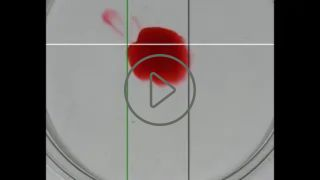
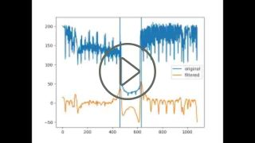

# Stain Recognition

Este software tem a finalidade de medir o diâmetro de uma mancha de tinta na água ao longo do tempo. Para reconhecer a mancha de tinta, utilizei dois algoritmos diferentes: um que eu mesmo criei e outro já conhecido, o [Hough Circle](https://en.wikipedia.org/wiki/Circle_Hough_Transform). Além de realizar essas medidas, esse programa também faz um trabalho visual, plotando em um gráfico as medidas tiradas e também marcando sobre o vídeo original a mancha que foi encontrada.
Utilizei ferramentas como PIL e Pyplot.

## Algoritmo próprio:
Esse algoritmo utiliza da diferença de luminosidade entre os pixels com tinta e os sem tinta em uma linha ou coluna selecionada. Alguns resultados:
### Mancha Dectada ao longo do tempo:

### Gráfico de evolução do diâmetro ao longo do tempo:

## Hough circle:
Aqui, utilizei um algoritmo pronto que detecta círculos na imagens. Foi necessário um preparo em cada frame com uma série de filtros antes de aplicar esse algorítmo em si. Alguns resultados:
### Mancha Dectada ao longo do tempo:

## Relatório final:
Fizemos [esse pôster](https://drive.google.com/file/d/1LXgTTkQI_ieISzlRc9NEjJfDrsMbgAeV/view?usp=sharing) com um resumo de todos os resultados obtidos.
